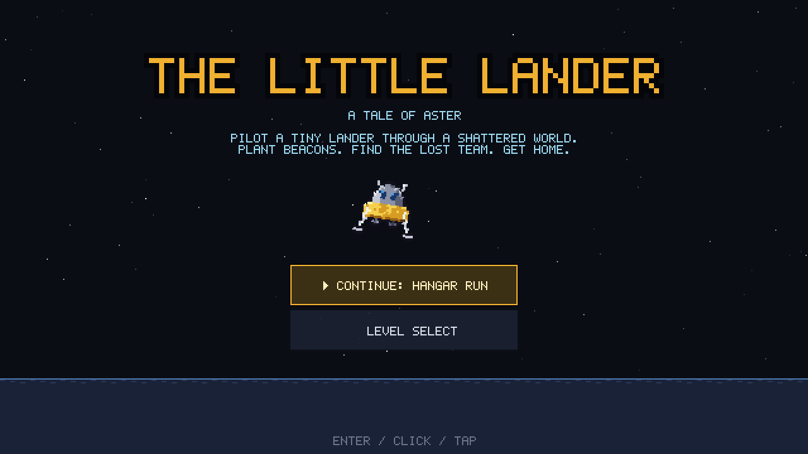
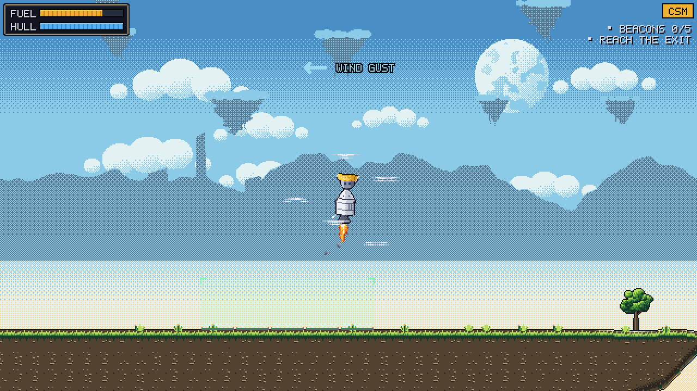
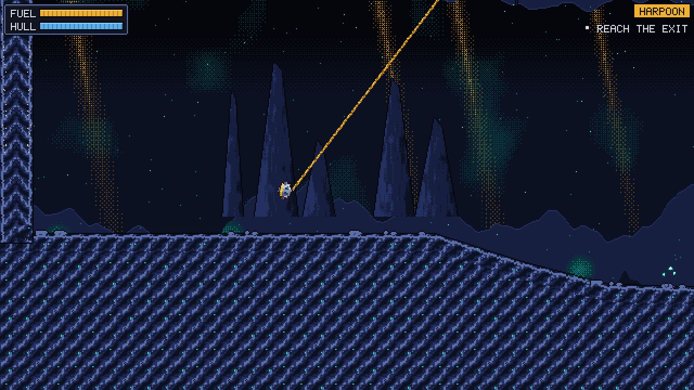
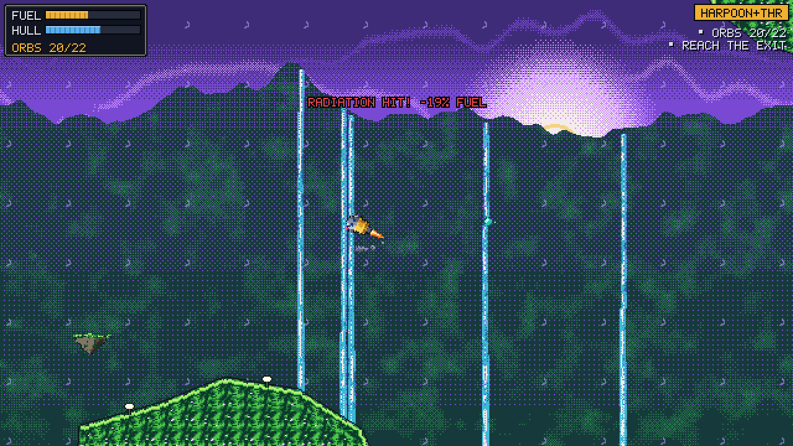
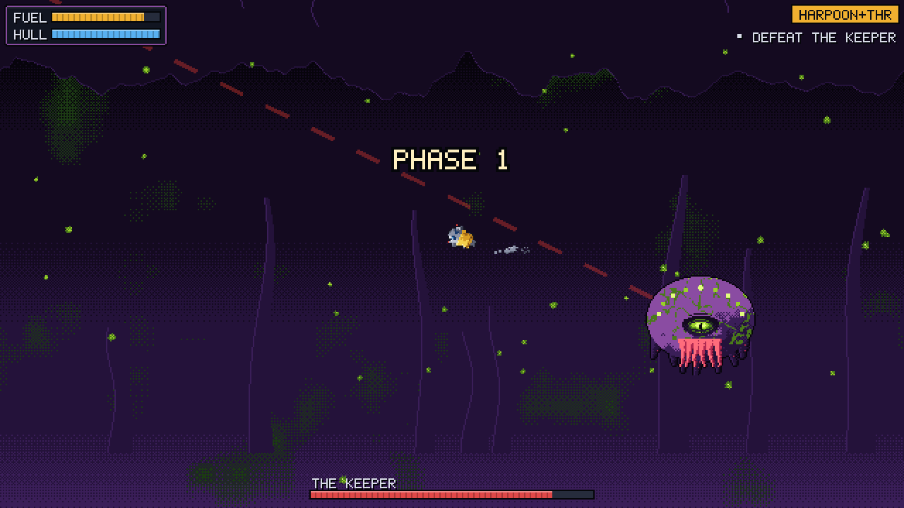

# The Little Lander

A pixel-art physics side-scroller. You are Wren, the best small-craft pilot
aboard the survey ship VSS Halcyon. Your job is to fly a tiny lander down
into **Aster**, a shattered world with a failing sun inside it. Plant nav
beacons, find the missing research team and get everyone home.

**Play in the browser:** https://janfredrics.github.io/the-little-lander/
(desktop keyboard/mouse or phone/tablet touch, best in landscape).



- **Real physics** (Box2D v3 / WASM): per-map gravity, gravity zones, wind
  gusts, drifting debris, clinging goo, radiation pulses, crumbling rock.
- **Four ways to fly**:
  - the twin-engine **lander**;
  - the pulsed single-thruster **CSM**;
  - the rope-swinging **harpoon pod**;
  - the harpoon pod with a thruster for the final acts.
- **Everything is generated in code.** Every sprite, terrain tile,
  backdrop, cutscene still and sound effect is procedural. There are no
  image or audio assets.
- **Story mode:** 8 maps linked by pixel-art cutscenes, a boss fight and a
  collapse escape. Every map you have reached stays open in level select.

| | |
|---|---|
|  |  |
|  |  |

## Controls

Each level opens with a controls card for the current vessel (press any
control to start). **Esc / P** (keyboard) or **II** (touch) pauses. The
pause menu can restart the level, show the controls card again and switch
the touch controls on, off or auto.

| Vessel | Keyboard / mouse | Touch |
|---|---|---|
| **CSM** (maps 2-3) | **W / ↑ / Space** thrust (pulse it, it is strong) · **A / ←** rotate left · **D / →** rotate right | ◀ ▶ under the left thumb rotate · **THRUST** under the right thumb (short taps) |
| **Lander** (maps 1, 3-4, 8) | **A / ← / J** left engine · **D / → / L** right engine · **W / ↑ / K / Space** both engines. One engine alone tilts you, so pulse to steer · **Q / U** top-left thruster · **E / O** top-right thruster (they push the other way: upside down, both lift you and one flips you back over) | **L ENG** bottom left · **R ENG** bottom right · hold both to go straight up · smaller **TOP L / TOP R** buttons above them fire the top thrusters |
| **Harpoon pod** (map 5) | **Mouse / arrows** aim · **Click / Space** fire · **Right click / X** release · **W / R** reel in · **S / F** reel out | Drag on the left half to aim · **FIRE / REL** harpoon · **▲ IN / ▼ OUT** reel |
| **Harpoon + thrust** (maps 6-7) | **Mouse / arrows** aim · **Click / Space** fire · **X** release · **W** thrust · **A / D** rotate · **R** reel in · **F** reel out | Drag on the left to aim · **FIRE / REL** · **▲▼** reel · **◀ ▶** rotate · **THR** thrust |

Touch controls appear automatically on touch devices. Force them with
`?touch=on` or `?touch=off`.

## The story

| # | Map | Vessel | What happens |
|---|---|---|---|
| 1 | Hangar Run | Lander | Get out of the Halcyon's hangar before the blast doors cycle |
| 2 | Descent | CSM | Hold on through the belt and the rough atmosphere |
| 3 | The Floating Isles | CSM → lander | Plant beacons across the isles; something big takes the CSM |
| 4 | The Throat | Lander | Descend the shaft into the island |
| 5 | The Vaults | Harpoon pod | Swing through crystal caverns on a rope |
| 6 | The Hollow | Harpoon + thrust | Collect orbs around the failing artificial sun |
| 7 | The Keeper | Harpoon + thrust | Defeat the sun's ancient guardian |
| 8 | The Mad Dash | Lander | Outrun the collapse with everyone aboard |

## Develop

```
npm ci
npm run dev       # Vite dev server
npm test          # Vitest (unit, physics, flow and full-playthrough tests)
npm run build     # typecheck + production build
npm run preview   # serve the production build (mobile checks via device emulation)
```

CI (`.github/workflows/deploy.yml`) runs the tests and the build on every
push and pull request. Only `main` deploys to GitHub Pages.

### URL flags

| Flag | Effect |
|---|---|
| `?level=<id>` or `?level=map1..map8` | Start that level directly (`?screen=title` overrides it) |
| `?debug` | Also list the debug levels (testpad, physlab) in level select |
| `?touch=on\|off\|auto` | Force the on-screen touch controls on or off (default: the saved preference) |
| `?telemetry` | Show the in-flight telemetry readout (time, fuel, hull, speed, fps; 4 Hz) |
| `?cutscene=<id>` | Cutscene viewer |
| `?gallery` | Procedural art gallery (sprites, tiles, backdrops, stills) |
| `?audiolab` | Sound-effect and music lab |

### Docs

- [PLAN.md](PLAN.md): design and slices.
- [PROCESS.md](PROCESS.md): delivery process.
- [RESIDUALS.md](RESIDUALS.md): known, deliberately parked issues.
- [research/inspiration/](research/inspiration/): style references.
